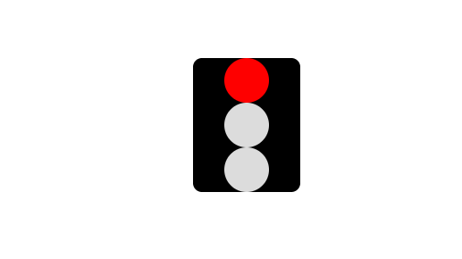

# 动画特效

CSS3 中新加了动画特性，animation、transition、transform等

## 属性 api

### animation

animation: name \| duration \| timing-function \| delay \| iteration-count \| direction \| fill-mode \| play-state;

<table>
  <thead>
    <tr>
      <th style="text-align:left">animation &#x52A8;&#x753B;</th>
      <th style="text-align:left">&#x5C5E;&#x6027;&#x503C;</th>
    </tr>
  </thead>
  <tbody>
    <tr>
      <td style="text-align:left">animation-name: &#x52A8;&#x753B;&#x540D;&#x79F0;</td>
      <td style="text-align:left">
        <p>name</p>
        <p>&#x683C;&#x5F0F;&#xFF1A;<b>@keyframes</b> name{
          <br />from{}
          <br />percentage{}
          <br />to{}
          <br />}</p>
      </td>
    </tr>
    <tr>
      <td style="text-align:left">animation-duration: &#x52A8;&#x753B;&#x6301;&#x7EED;&#x65F6;&#x95F4;</td>
      <td
      style="text-align:left">0&#xFF08;&#x9ED8;&#x8BA4;&#xFF09;</td>
    </tr>
    <tr>
      <td style="text-align:left">animation-timing-function: &#x52A8;&#x753B;&#x901F;&#x5EA6;&#x66F2;&#x7EBF;</td>
      <td
      style="text-align:left">
        <p>ease&#xFF08;&#x9ED8;&#x8BA4;&#xFF09;
          <br />linear</p>
        <p>ease-in</p>
        <p>ease-out</p>
        <p>ease-in-out</p>
        <p>cubic-bezier(x,x,x,x)
          <br /><em>x&#x503C;&#x4E3A;0~1&#x95F4;</em>
        </p>
        </td>
    </tr>
    <tr>
      <td style="text-align:left">animation-delay: &#x52A8;&#x753B;&#x5EF6;&#x8FDF;&#x5F00;&#x59CB;&#x65F6;&#x95F4;</td>
      <td
      style="text-align:left">
        <p>0&#xFF08;&#x9ED8;&#x8BA4;&#xFF09;</p>
        <p>&#x53EF;&#x4E3A;&#x8D1F;&#x503C;</p>
        </td>
    </tr>
    <tr>
      <td style="text-align:left">animation-iteration-count: &#x52A8;&#x753B;&#x64AD;&#x653E;&#x6B21;&#x6570;</td>
      <td
      style="text-align:left">
        <p>1&#xFF08;&#x9ED8;&#x8BA4;&#xFF09;</p>
        <p>infinite</p>
        </td>
    </tr>
    <tr>
      <td style="text-align:left">animation-direction: &#x52A8;&#x753B;&#x8F6E;&#x6D41;&#x53CD;&#x5411;&#x64AD;&#x653E;</td>
      <td
      style="text-align:left">
        <p>normal&#xFF08;&#x9ED8;&#x8BA4;&#xFF09;
          <br />reverse</p>
        <p>alternate</p>
        <p>alternate-reverse</p>
        </td>
    </tr>
    <tr>
      <td style="text-align:left">animation-fill-mode: &#x52A8;&#x753B;&#x6267;&#x884C;&#x524D;&#x540E;&#x6837;&#x5F0F;&#x5E94;&#x7528;</td>
      <td
      style="text-align:left">
        <p>none&#xFF08;&#x9ED8;&#x8BA4;&#xFF09;</p>
        <p>forwards</p>
        <p>backwards</p>
        <p>both</p>
        </td>
    </tr>
    <tr>
      <td style="text-align:left">animation-play-state: &#x52A8;&#x753B;&#x8FD0;&#x884C;&#x6216;&#x6682;&#x505C;</td>
      <td
      style="text-align:left">
        <p>running</p>
        <p>paused</p>
        </td>
    </tr>
  </tbody>
</table>

### transition

transition: property \| duration \| timing-function \| delay;

<table>
  <thead>
    <tr>
      <th style="text-align:left">transition &#x8FC7;&#x6E21;</th>
      <th style="text-align:left">&#x5C5E;&#x6027;&#x503C;</th>
    </tr>
  </thead>
  <tbody>
    <tr>
      <td style="text-align:left">transition-property: &#x8FC7;&#x6E21;&#x7684;&#x5C5E;&#x6027;</td>
      <td
      style="text-align:left">
        <p>&#x5C5E;&#x6027;&#x540D;&#x5217;&#x8868;</p>
        <p>none</p>
        <p>all</p>
        </td>
    </tr>
    <tr>
      <td style="text-align:left">transition-duration: &#x8FC7;&#x6E21;&#x65F6;&#x95F4;</td>
      <td style="text-align:left">0&#xFF08;&#x9ED8;&#x8BA4;&#xFF09;</td>
    </tr>
    <tr>
      <td style="text-align:left">transition-timing-function: &#x8FC7;&#x6E21;&#x901F;&#x5EA6;&#x66F2;&#x7EBF;</td>
      <td
      style="text-align:left">
        <p>ease&#xFF08;&#x9ED8;&#x8BA4;&#xFF09;&#x9010;&#x6E10;&#x53D8;&#x6162;
          <br
          />linear &#x5300;&#x901F;</p>
        <p>ease-in &#x52A0;&#x901F;</p>
        <p>ease-out &#x51CF;&#x901F;</p>
        <p>ease-in-out &#x52A0;&#x901F;&#x540E;&#x51CF;&#x901F;</p>
        <p>cubic-bezier(x1, y1, x2, y2) &#x8D1D;&#x585E;&#x5C14;&#x66F2;&#x7EBF;&#x5B9A;&#x4E49;
          <br
          /><em>&#x503C;&#x4E3A; [0~1]</em>
        </p>
        </td>
    </tr>
    <tr>
      <td style="text-align:left">transition-delay: &#x8FC7;&#x6E21;&#x6548;&#x679C;&#x5F00;&#x59CB;&#x524D;&#x7B49;&#x5F85;&#x7684;&#x65F6;&#x95F4;</td>
      <td
      style="text-align:left">0&#xFF08;&#x9ED8;&#x8BA4;&#xFF09;</td>
    </tr>
  </tbody>
</table>

### transform 

transform: translate\(\) \| scale\(\) \| rotate\(\) \| skew\(\) \| matrix\(\);

| transform 值 | 备注 |
| :--- | :--- |
| **transform: translate\(x, y\);** | 二维平移，x、y 分别为水平和垂直方向偏移量 |
| transform: translateX\(x\); | x 轴方向平移 |
| transform: translateY\(y\); | y 轴方向平移 |
| transform: translateZ\(z\); | z 轴方向平移 |
| **transform: translate3d\(x, y, z\);** | 三维平移 |
| **transform: scale\(sx, sy\);** | 缩放，sx、sy分别为水平、垂直方向缩放量 |
| transform: scaleX\(sx\) | x 轴方向缩放 |
| transform: scaleY\(sy\) | y 轴方向缩放 |
| transform: scaleY\(sz\) | z 轴方向缩放 |
| **transform: scale3d\(sx, sy, sz\)** | 三维缩放 |
| **transform: rotate\(45deg\)** | 旋转角度， rotate\(0.5return\) |
| transform: rotateX\(45deg\) | x 轴方向旋转 |
| transform: rotateY\(45deg\) | y 轴方向旋转 |
| transform: rotateZ\(45deg\) | z 轴方向旋转 |
| **transform: rotate3d\(x, y, z, a\)** | 3D 旋转, a为旋转的角度  rotate3d\(10, 15, 20, 180deg\) |
| **transform: skew\(sx, sy\)** | 拉伸， sx, sy 为 沿x、y 轴拉伸元素的角度 |
| transform: skewX\(sx\) | 水平拉伸 |
| transform: skewY\(sy\) | 垂直拉伸 |
| **transform: matrix\(a, b, c, d, tx, ty\)** | 二维矩阵变换 |

有趣的动画

红绿灯



```css
    <!-- 红绿灯交替动画 -->
    <ul class="traffic-light">
        <li class="circle red"></li>
        <li class="circle orange"></li>
        <li class="circle green"></li>
    </ul>
```



```css
/* 红绿灯动画 */
    .traffic-light {
        width: 120px;
        margin: 0 auto;
        border: 1px solid gainsboro;
        border-radius: 10px;
        background: black;
    }

    .traffic-light .circle {
        width: 50px;
        height: 50px;
        border-radius: 50%;
        margin: 0 auto;
        background: gainsboro;
        list-style: none;im
    }

    .red {
        animation: redlight 5s linear infinite;
    }

    .orange {
        animation: orangelight 5s linear infinite;
    }

    .green {
        animation: greenlight 5s linear infinite;
    }

    @keyframes redlight {

        0% {
            background: gainsboro;
        }

        2%,
        40% {
            background: #ff0000;
        }

        42%,
        100% {
            background: gainsboro;
        }
    }

    @keyframes orangelight {

        0%,
        40% {
            background: gainsboro;
        }

        41%,
        60% {
            background: #ec9d0e;
        }

        61%,
        100% {
            background: gainsboro;
        }
    }

    @keyframes greenlight {

        0%,
        60% {
            background: gainsboro;
        }

        61%,
        84% {
            background: #008000;
        }

        85%,
        90% {
            background: gainsboro;
        }

        85%,
        90% {
            background: #008000;
        }

        91%,
        94% {
            background: gainsboro;
        }

        95%,
        100% {
            background: #008000;
        }
    }
```





